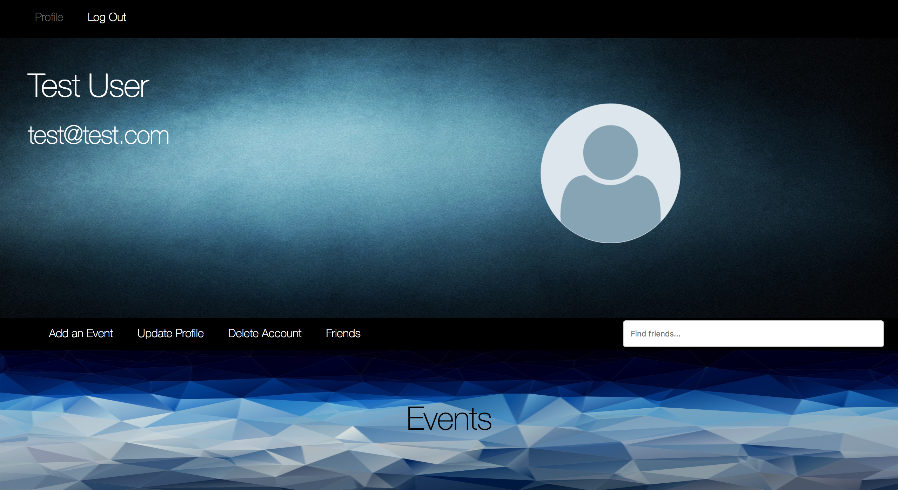
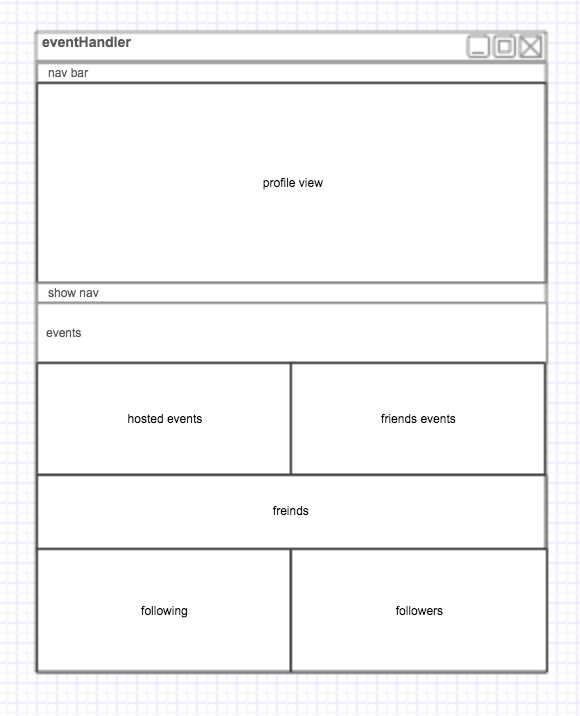

# eventHandler

Welcome to eventHandler! The goal for this project was to create an app that lets users create events and share them with their followers. To get started, sign up and get started by adding some events and finding some friends to follow. Try it out [here](https://dseventhandler.herokuapp.com/).

# Technologies Used

- NodeJs/Express
	- Backend server
- React
	- Client App
- React Router
	- Manage Views in Client
- Axios
	- Requests from client to api
- HTML
- CSS
- Milligram
	- CSS framwork for basic styles

# General Approach

My approach for the project was to start off by getting full CRUD for my users. I wanted to focus on getting all of the authentication and database control done by using Postman to test all of my backend routes.

After making sure my backend routes were working correctly, I moved on to making my React client app. I started by making all of the forms i would need for creating users, logging in, creating events, and editing users and events.

After creating the views, I worked on getting relevant information from the database on the correct show pages. I also used this time to create ways to show if you were attending events and who you are following/followers.

I am currently working on styling all of the views to give them a uniform appearance.

# User Stories

I used Trello to manage user stories and track project progress. You can check them out [here](https://trello.com/b/D3ROWYRp/eventhandler).

# Wireframe

Below is a wireframe of the main profile view. I feel like this is the most important view because this will be the first thing the user sees when logging in and is where the most information is dispayed.

# Difficulties

I struggled the most with React components

- Passing data between components
- Controlling state for multiple elements with one input
- Re Rendering components when needed.

# Unsolved Issues

- Friends list doesn't update when you add a new friend
- Friends event list doesn't update when you add new friends
- lots of little things...

